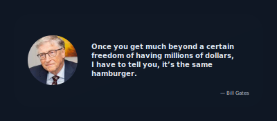
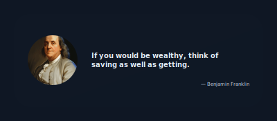

<div align="center">
    <h2>Finance Quote API</h2>
    
</div>

## Overview
This project is a RESTful API built with FastAPI that provides access to a collection of quotes. It's designed to be a simple and fast service for retrieving quotes, with additional functionality for generating beautiful, customizable SVG images of the quotes.

## Table of Contents
- [Features](#-features)
- [API Endpoints](#-api-endpoints)
- [License](#-license)
- [Author](#-author)

### ✨ Features
- Retrieve Random Quotes: Get a random quote from the entire collection or filter by type.
- Fetch Specific Quotes: Access a quote directly using its unique ID.
- Customizable SVG Output: Generate quotes as shareable SVG images. You can customize the theme, width, and height of the image via query parameters.

### 📖 API Endpoints

#### Health Check
The health check endpoint is a simple way to verify that the application is up and running.

`GET /health`

- Description: Returns a `200 OK` status with a simple JSON payload.
- Response:
```
{
  "status": "ok"
}
```

#### Quotes

These endpoints are the core of the API, providing access to the quote collection.

`GET /api/quotes/random`

- Description: Retrieves a random quote from the collection.
- Query Parameters:
    - **quote_type** *(optional, string)* – Filter by type (e.g., `inspiration`, `pracmatical`).
    - **response_type** *(optional, string)* – Format of response:
    - `json` *(default)*
    - `svg`
    - **theme** *(optional, string)* – Color theme for SVG: `light` *(default)* or `dark`.
    - **width** *(optional, int)* – SVG width. Range: **400–600**.
    - **height** *(optional, int)* – SVG height. Range: **175–300**.
- Example (JSON Response):
```http
GET /api/quotes/random?quote_type=inspiration
```
```json
{
  "id": 3,
  "quote": "Once you get much beyond a certain freedom of having millions of dollars, I have to tell you, it’s the same hamburger.",
  "author": "Bill Gates",
  "author_avatar_url": "https://encrypted-tbn0.gstatic.com/images?q=tbn:ANd9GcQCNQD1uEyyUbtJxMdpneAHTM2XflvSZ6KPylf1PYP4L33NTxwnRDZsk4TxjKtmb2EELZ8&usqp=CAU",
  "type": "inspiration"
}
```
- Example (SVG Response):
```http
GET /api/quotes/random?response_type=svg&theme=dark&width=400&height=175
```


`GET /api/quotes/{id}`
- Description: Retrieves a specific quote by its unique ID.
- Path Parameters:
    - **id** (int, required) - Unique ID of the quote
- Query Parameters:
    - **quote_type** *(optional, string)* – Filter by type (e.g., `inspiration`, `pracmatical`).
    - **response_type** *(optional, string)* – Format of response:
    - `json` *(default)*
    - `svg`
    - **theme** *(optional, string)* – Color theme for SVG: `light` *(default)* or `dark`.
    - **width** *(optional, int)* – SVG width. Range: **400–600**.
    - **height** *(optional, int)* – SVG height. Range: **175–300**.
- Examples (JSON Response)
```http
GET /api/quotes/1
```
```
{
  "id": 1,
  "quote": "If you would be wealthy, think of saving as well as getting.",
  "author": "Benjamin Franklin",
  "author_avatar_url": "https://www.shutterstock.com/image-illustration/benjamin-franklin-digital-oil-painting-600nw-2214535093.jpg",
  "type": "inspiration"
}
```
- Example (SVG Response)
```
GET /api/quotes/1?response_type=svg&theme=dark&width=400&height=175
```


### 📄 License
This project is licensed under the [MIT License](/LICENSE.md).

### ✍🏼 Author
- Lưu Tấn Hưng | [GitHub](https://github.com/luutanhung) | [X](https://x.com/luu_tan_hung) | <luutanhung.dev@gmail.com>
